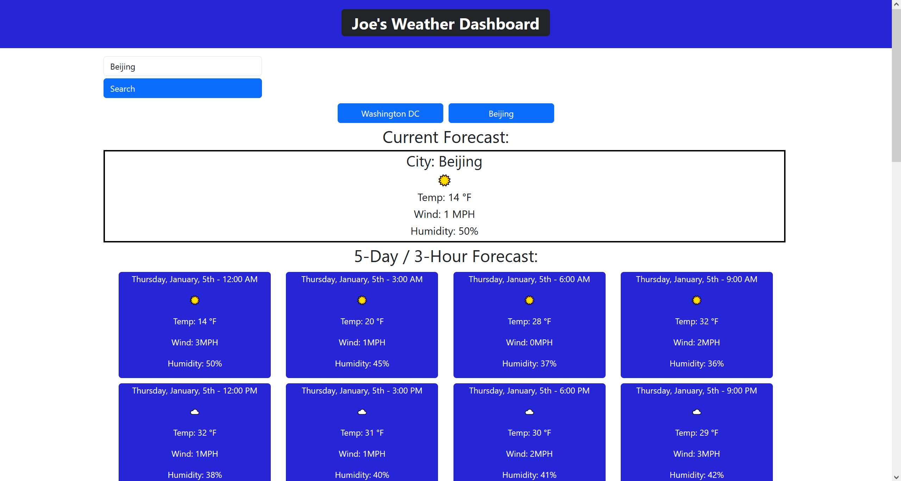

# Joe's Weather Dashboard
HTML, CSS, JavaScript, Bootstrap, APIs, and Local Storage. 

## A challenge to make weather forecast API calls and store searches in local storage.

I created a webpage that takes a city name and returns the current weather for a given city.

## Installation

N/A

## Usage

I created a webpage that takes a city name and returns the current weather for a given city in a large box, then returns a five day forecast separated by 3-hour increments in small cards. The city name search is then stored in local storage and a button is created to save that search. The button can be clicked to re-run the search for that city or a new city name can be searched.

[Website Link](https://codejoes.github.io/Weather-Dashboard/)

## Credits

Bootstrap, DayJS, WeatherNow API

## License

N/A